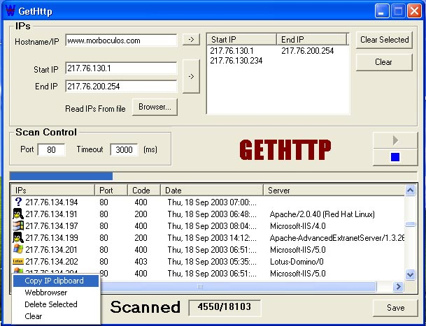



## GetHttp

### Description

An escanner multisock than escannea 100 port for seconds.and get the servant that runs in the serverIt brings escnner for txt for ip and for ranges of ip. good program is to try and after, hold an opinion .
 
### More Info
 

             |
---                |---
**Submitted On**   |2003-09-18 00:14:18
**By**             |[Manuel\(ErcUn\)](https://github.com/Planet-Source-Code/PSCIndex/blob/master/ByAuthor/manuel-ercun.md)
**Level**          |Beginner
**User Rating**    |5.0 (20 globes from 4 users)
**Compatibility**  |VB 6\.0
**Category**       |[Complete Applications](https://github.com/Planet-Source-Code/PSCIndex/blob/master/ByCategory/complete-applications__1-27.md)
**World**          |[Visual Basic](https://github.com/Planet-Source-Code/PSCIndex/blob/master/ByWorld/visual-basic.md)
**Archive File**   |[GetHttp1646809182003\.zip](https://github.com/Planet-Source-Code/manuel-ercun-gethttp__1-48595/archive/master.zip)

